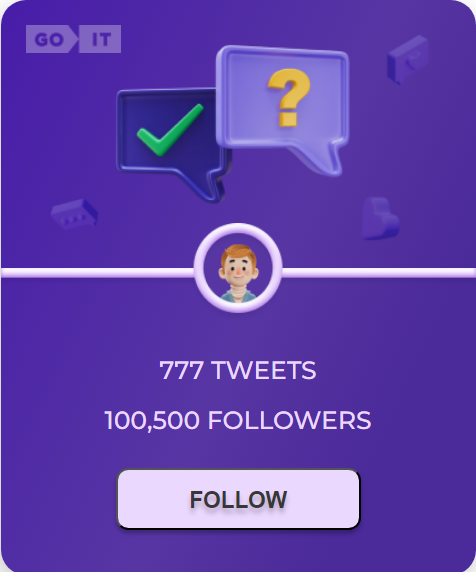
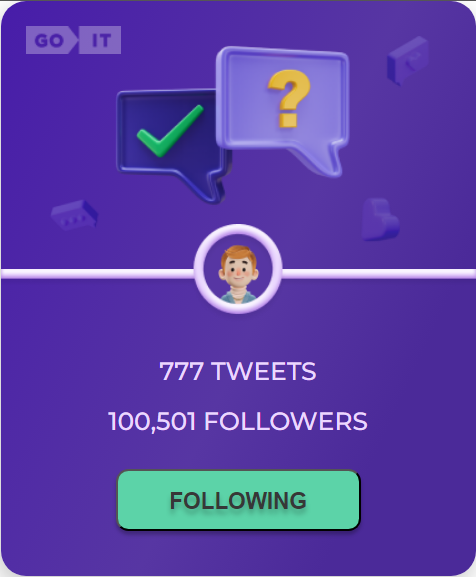

# FOLLOW CARD

This project was created with
[Create React App](https://github.com/facebook/create-react-app). To familiarize yourself with and configure additional features [refer to the documentation](https://facebook.github.io/create-react-app/docs/getting-started).

## About

This application was created to follow the news of users in social networks. To do this, press the button `FOLLOW`.

 Its appearance will change and show that you are subscribed to the user.

If you change your mind, you can click the button `FOLLOWING` again and the subscription will be canceled. The button `FOLLOWING` will change its color and the inscription on `FOLLOW`. 

The application remembers your choice even after loading the page.

## DEMO

You can test the application using the [link](https://classika88.github.io/test-task/). 
I wish you a pleasant use!

 
